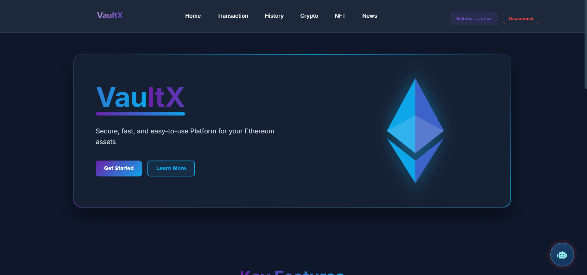

# 🚀 VaultX — A Multi-Chain Crypto Management Platform

**VaultX** is a powerful, user-friendly platform built to simplify your cryptocurrency journey across multiple blockchains. Whether you're sending, receiving, or tracking assets, VaultX puts everything you need in one seamless interface — built with performance, security, and experience at its core.

---

## 🌟 Project Overview

VaultX is a full-stack application that provides a unified interface for managing cryptocurrencies across multiple blockchain networks. The platform consists of:

- **Frontend**: A modern React application built with Vite
- **Backend**: A high-performance Rust server using Warp framework
- **Smart Contracts**: Custom Solidity contracts for enhanced functionality

---

## 💡 Core Features

### Cross-Chain Management
- 🔁 **Multi-Chain Support**: Currently supports Holesky and Sepolia testnets
- 💼 **Unified Wallet Interface**: Single dashboard for all your crypto assets
- 🔐 **Secure Transactions**: End-to-end encrypted transaction handling

### Asset Management
- 📊 **Real-Time Balances**: Instant updates of wallet balances across chains
- 📈 **Transaction History**: Comprehensive transaction logs with metadata
- ⛽ **Gas Optimization**: Real-time gas price tracking and optimization

### Security Features
- 🔒 **Signature Verification**: Secure transaction signing process
- 🛡️ **Multi-Signature Support**: Enhanced security for high-value transactions
- 🔐 **Private Key Management**: Secure storage and handling of private keys


- **Manage assets** across multiple chains seamlessly
- **Track balances** in real-time with precision
- **Execute transactions** with confidence and clarity
- **Monitor gas fees** to optimize transaction costs

## 🛠️ Technical Architecture

### Frontend Stack
- **Framework**: React 18 with Vite
- **State Management**: React Context API
- **UI Components**: Custom-built components with CSS modules
- **Routing**: React Router v6
- **API Integration**: Axios for backend communication
- **Environment**: Node.js with npm package manager

### Backend Stack
- **Language**: Rust
- **Framework**: Warp for high-performance HTTP server
- **Blockchain Integration**: 
  - ethers-rs for Ethereum interaction
  - Web3.rs for multi-chain support
- **API**: RESTful endpoints with JSON responses

### Smart Contracts
- **Language**: Solidity
- **Framework**: Remix for development and testing
- **Features**:
  - Multi-signature wallet contracts
  - Cross-chain bridge contracts
  - Gas optimization contracts

## 🛠️ Technology Stack

## 📦 Project Structure

```
vaultx/
├── frontend/               # React frontend application
│   ├── src/
│   │   ├── components/    # Reusable UI components
│   │   ├── pages/        # Page components
│   │   ├── services/     # API services
│   │   ├── context/      # React context providers
│   │   └── utils/        # Utility functions
│   └── public/           # Static assets
│
├── backend/               # Rust backend server
│   ├── src/
│   │   ├── routes/       # API route handlers
│   │   └── main.rs       # Server entry point
│   └── contracts/        # Smart contracts
│
└── README.md             # Project documentation
```

### Backend (Rust)
- **Warp** - High-performance web framework
- **ethers-rs** - Ethereum interaction with WebSocket support
- **tokio** - Asynchronous runtime for optimal performance
- **serde** - Efficient data serialization
- **dotenv** - Environment configuration management
- **chrono** - Precise date and time handling

### Frontend (React + Vite)
- **Vite** - Next-generation frontend tooling
- **React** - Responsive UI components
- **ESLint** - Code quality enforcement
- **Responsive Design** - Optimized for both desktop and mobile

## 🚀 Getting Started

### Prerequisites
- Node.js (v18 or higher)
- Rust (latest stable)
- Pinata/IPFS
- MetaMask or compatible Web3 wallet

### Installation

1. Clone the repository:
```bash
git clone https://github.com/R0hit-Yadav/MIT_BITCOIN-2025.git
cd MIT_BITCOIN-2025
```

2. Set up the backend:
```bash
cd backend
# Install dependencies
cargo build
# Start the server
cargo run
```

3. Set up the frontend:
```bash
cd frontend
# Install dependencies
npm install
# Start the development server
npm run dev

```

4. Access the application:
- Frontend: http://localhost:5173
- Backend API: http://localhost:8080


## 🔧 Development

### Frontend Development
```bash
cd frontend
npm run dev        # Start development server
npm run build     # Build for production
npm run test      # Run tests
npm run lint      # Run linter
```

### Backend Development
```bash
cd backend
cargo run         # Start development server
cargo test        # Run tests
cargo clippy      # Run linter
```

### Smart Contract Development
Deployed on Remix IDE

---

## 🧪 Testing

- **Frontend**: React + Vite Testing Library
- **Backend**: Rust's built-in testing framework
- **Smart Contracts**: Solidty + Remix IDE
- **Integration**: Postman for API testing

```
The application will be available at:
- Frontend: http://localhost:5173
- Backend: http://localhost:3000
```

## 🔒 Security Considerations

- Private keys are never stored on the server
- All sensitive data is encrypted in transit and at rest
- Regular security audits and penetration testing
- Multi-signature support for high-value transactions
- Rate limiting and DDoS protection

---

## 📈 Performance Optimization

- Frontend code splitting and lazy loading
- Backend caching for frequently accessed data
- Optimized database queries
- WebSocket connections for real-time updates
- Gas optimization for transaction

We welcome contributions from the community! Whether you're fixing bugs, adding features, or improving documentation, your help makes VaultX better for everyone.


1. Fork the repository
2. Create your feature branch (`git checkout -b feature/amazing-feature`)
3. Commit your changes (`git commit -m 'Add some amazing feature'`)
4. Push to the branch (`git push origin feature/amazing-feature`)
5. Open a Pull Request

## 🤝 Contributing

1. Fork the repository
2. Contribute 


VaultX aims to become the definitive solution for crypto asset management, bringing simplicity to blockchain complexity and empowering users with complete control over their digital future.

## 📄 License

This project is licensed under the MIT License - see the [LICENSE](./LICENSE) file for details.

---

## 🙏 Acknowledgments

- Ethereum Foundation
- Rust Community
- React Community
- All contributors and supporters

---

> **VaultX** — Your Gateway to Multi-Chain Crypto Management 🔗
>
> ---

## 📸 Project Screenshots

### Home Page 



### Transaction Interface


### History Page 


### Crypto Page 


### NFTs Marketplace Page 


### AI Chatbot


---
